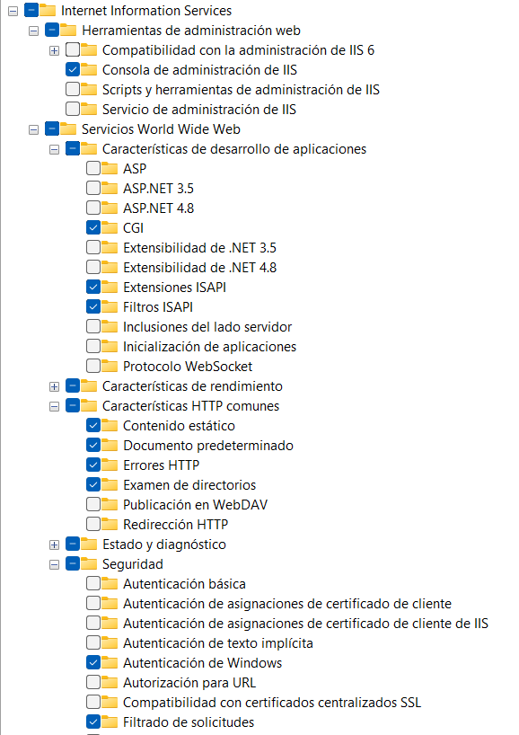

# 🧰 1. Instalar IIS en Windows
## ✅ Paso 1: Activar IIS
Abre el Panel de control → "Programas" → "Activar o desactivar las características de Windows".
Marca lo siguiente (ver imagen):


Acepta y espera a que se instale.

y hay que cambiar en laragon el puerto en el apache en httpd.conf y poner puerto 8080
````
Menú >> Apache >> httpd.conf
Linea 60 (aprox)
Listen 8080
````

después no olvidar que en c/laragon/www en index.php poner la url con 8080:
```
<div class="opt">
<div><a title="Getting Started" href="https://laragon.org/docs">Getting Started</a></div>
<div><a title="Getting Started" href="http://localhost:8080/reta">RETA</a></div>
<div><a title="Getting Started" href="http://localhost:8080/categoria">Categoria</a></div>
</div> 
```
 
Ahora sigue estos pasos para asegurarte de que todo esté bien configurado:
 
## PASO 2 ✅ PASOS FINALES PARA CONFIGURAR PHP 8.3 EN IIS CON FASTCGI
### 1. Instalar desde https://windows.php.net/download, compilada para x64.
Extrae la carpeta php-8.3.25-Win32-vs16-x64 en la ruta: C:\PHP
- Opcion 1 con linea de comando: 
Agrega C:\PHP al PATH, abre CMD como administrador y escribe: setx /M Path "%Path%;C:\PHP"
Comprueba que esté escribiendo en cmd echo %PATH% y luego verifica escribiendo php -v.

- Opcion 2 con entorno gráfico:
🧭 Añadir al PATH desde la interfaz gráfica
Presiona Win + S y busca "variables de entorno".
Haz clic en "Editar las variables de entorno del sistema".
En la ventana de Propiedades del sistema, haz clic en "Variables de entorno...".
En la sección "Variables del sistema" (o "Variables de usuario" si solo lo quieres para tu usuario):
Selecciona la variable llamada Path y haz clic en "Editar...".
Haz clic en "Nuevo" y añade la ruta que deseas (por ejemplo: D:\Oreka\PHP)
Acepta todas las ventanas para guardar los cambios.
 ```
### 2. Dentro de C:\PHP, renombra php.ini-development a php.ini y ajusta por lo menos estas líneas:
NOTA: 🔧 Si ya están presentes pero comentadas con ;, elimína el ;
 ```
extension_dir = "ext"
extension=ldap
cgi.force_redirect = 0
fastcgi.impersonate = 1
```

Copiar en la carpeta Oreka:/sqltools los dll: 
- php_pdo_sqlsrv_83_ts_x64.dll
- php_sqlsrv_83_ts_x64.dll

y en el archivo php.ini añadir las líneas:

extension="D:\Oreka\sqltools\php_pdo_sqlsrv_83_ts_x64.dll"
extension="D:\Oreka\sqltools\php_sqlsrv_83_ts_x64.dll"


### 3. Configura el entorno FastCGI en IIS
Abre Administrador de IIS (escribe IIS en busqueda y aparece como Administrador de Internet Information Services (IIS)) → Haz clic en el nombre del servidor, a la izquierda del todo, en mi caso es el nombre de mi equipo LACAJA.
 
En el centro Abre Configuración de FastCGI.
 
Si no aparece la entrada con php-cgi.exe, pulsa Agregar aplicación:
 
Ruta completa al ejecutable:
C:\PHP\php-cgi.exe
Luego haz doble clic sobre esa entrada para editarla.
 
En Variables de entorno, añade estas dos entradas:
 
Nombre	Valor
PHPRC	C:\PHP
REDIRECT_STATUS	200
 
### 4. Configura el manejador de modulo en Asignaciones de controlador
En el panel izquierdo, despliega el servidor que en mi caso es LACAJA -> Sitios -> haz clic en "Default Web Site".
 
Abre Asignaciones de controlador.
 
Haz clic en Agregar asignación de modulo... (panel derecho).
 
Ruta de acceso de solicitudes: *.php

Módulo: FastCgiModule

Ejecutable: D:\Oreka\PHP\php-cgi.exe

Nombre: PHP_via_FastCGI
 
✅ Acepta todo.
 
### 5. Reinicia IIS
En el panel derecho (en el nodo del servidor), haz clic en Reiniciar o escribe en CMD: iisreset
 
### 6. Crea archivo info.php
Guárdalo en:
 
C:\inetpub\wwwroot\info.php
Con este contenido:
``` 
<?php phpinfo(); ?>
```
### 7. Iniciar el Sitio
```
SERVIDOR >>
    Sitios >>
        Default Web Site (botón derecho)
            Administrar sitio web >>
                Iniciar
```

🚀 Accede a:
http://localhost/info.php
 
Si lo ves está todo correcto.

Se pueden aregar mas sitios con esta estructura
```
C:\inetpub\
│
├── wwwroot                ← para el sitio por defecto (no lo toques si no lo usas)
├── miweb1                 ← tu primer sitio nuevo
│   └── index.html
├── miweb2                 ← otro sitio separado
│   └── info.php

```

## 🔐 3. Configurar Autenticación Integrada (Active Directory)
### ✅ Paso 1: Activar Autenticación de Windows
Abre IIS Manager (inetmgr).
 
Selecciona tu sitio web en mi caso una vez elijo el servidor LACAJA, despliego -> Sitios -> Default Web Site.
 
Haz doble clic en Autenticación.
 
Desactiva "Autenticación anónima".
 
Activa "Autenticación de Windows".
 
⚠️ Esto solo funciona en una red donde los usuarios están unidos al dominio de Active Directory.
 
Ahora vamos a C:\inetpub\wwwroot:
 
Crear un archivo llamado:
info.php -> si lo tenemos creado de antes perfecto
Dentro de ese archivo, pega este contenido:
 
<?php
echo $_SERVER['REMOTE_USER'];
?>
 
Ahora escribimos en el navegador: http://localhost/info.php y nos pide usuario y contraseña. Para saber el usuario de tu windows, escribes en cmd: whoami, te devuelve la máquina y el usuario, escribes el usuario. Luego en contraseña la que tengas en windows, si no tienes, no poner nada. Se abrirá la web y veremos que nos imprime perfectamente el usuario.

